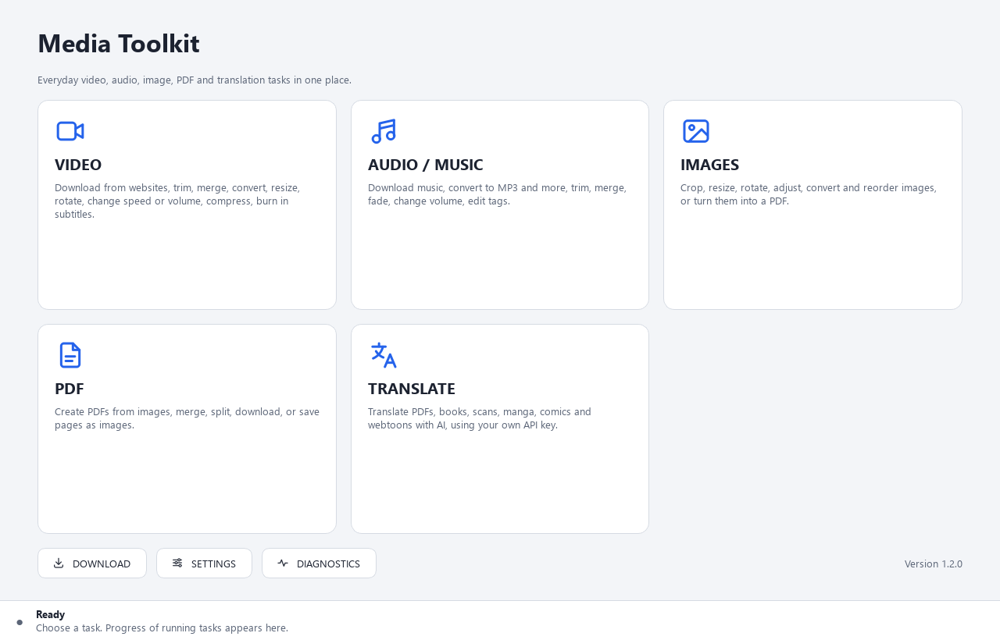
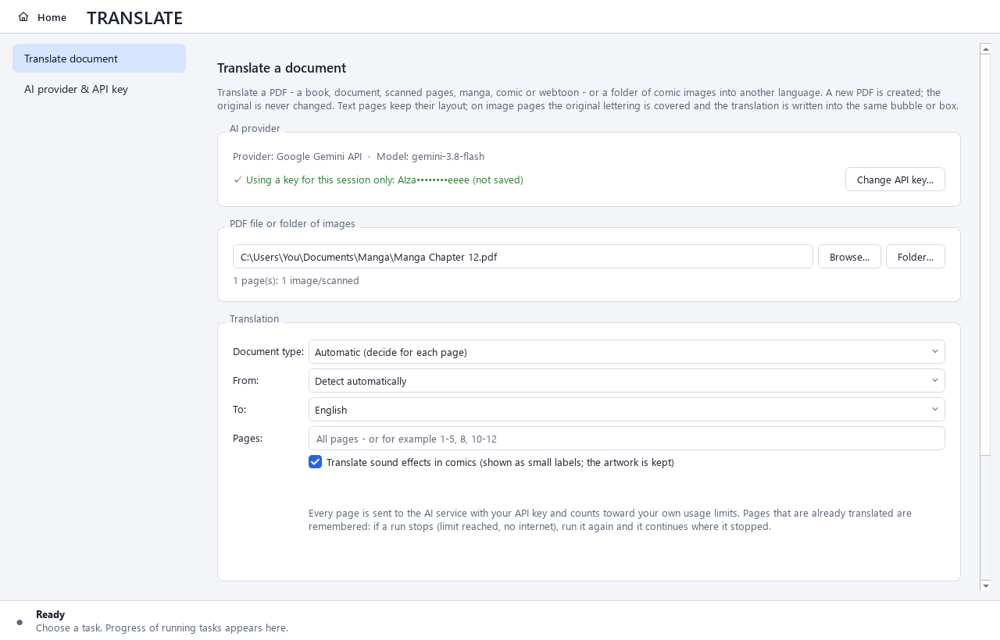
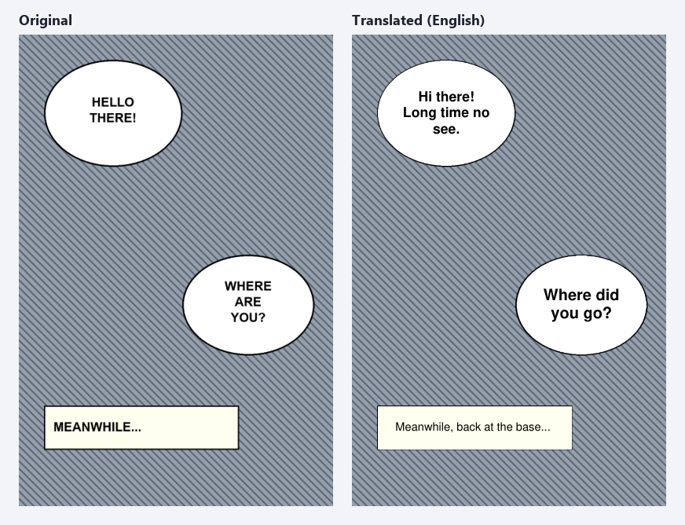
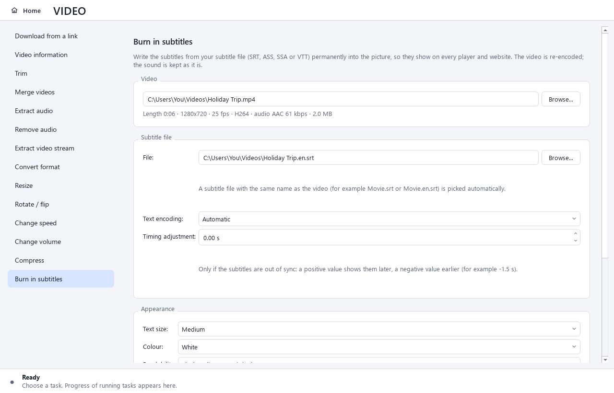
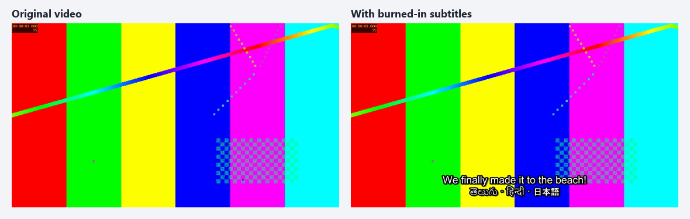
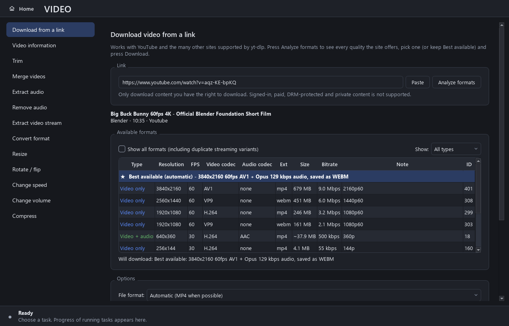
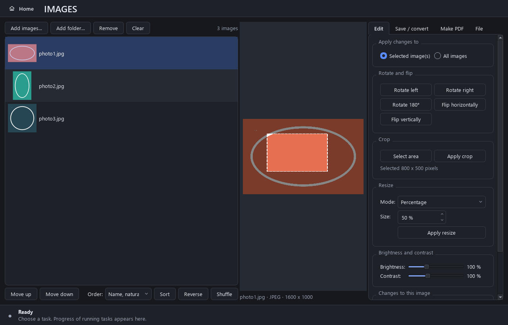
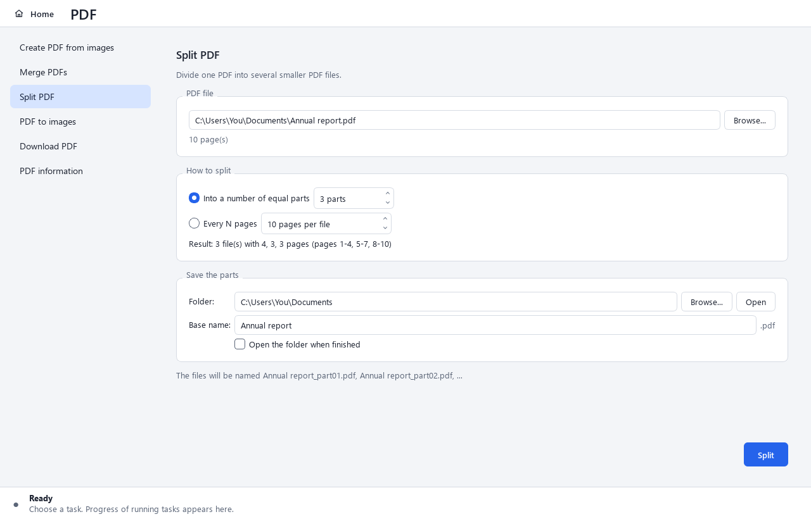

<p align="center">
  
</p>

<h1 align="center">Media Toolkit</h1>

<p align="center">
  One simple Windows app for everyday <b>video</b>, <b>audio</b>, <b>image</b> and <b>PDF</b> jobs - and <b>AI translation</b> of books, scans, manga and comics.<br>
  Download from websites · trim · merge · convert · compress · burn in subtitles · crop · reorder · make, merge and split PDFs · translate PDFs
</p>

<p align="center">
  <a href="../../releases/latest"><b>⬇ Download for Windows</b></a>
  &nbsp;·&nbsp; Windows 10 / 11 (64-bit)
  &nbsp;·&nbsp; Nothing else to install - FFmpeg and yt-dlp are included
</p>

<p align="center">
  
</p>

---

## Download

Go to the [**latest release**](../../releases/latest) and pick one file:

| File | Choose it if you want |
|---|---|
| `MediaToolkit-1.2.0-Setup.exe` (≈130 MB) | A normal installed app: Start Menu entry, optional desktop shortcut, uninstall from *Settings → Apps*. Opens in about a second. **Recommended.** |
| `MediaToolkit-1.2.0-Portable.exe` (≈180 MB) | A single file you can run from any folder or USB stick, without installing. Takes about 5 seconds to open. |

* The installer does **not** need administrator rights (it installs for your user; you can choose "all users" on the first page).
* **"Windows protected your PC"?** The app is not code-signed yet, so SmartScreen may warn the first time. Click **More info → Run anyway**.
* Each release includes `SHA256SUMS.txt` so you can check the download (`Get-FileHash <file>` in PowerShell).
* **Updating:** download the new installer and run it. It **replaces the installed version** - same folder, shortcuts and entry in *Settings → Apps*, so you never end up with two copies - and keeps your settings. The portable EXE is a single file that is never installed, so after downloading a new one simply delete the old file. From version 1.2.0 on, the app tells you when a new version is available (see [Updates](#updates)); versions 1.0.0 and 1.1.0 cannot do that yet, so update those once by hand. (Coming from 1.0.0: the settings folder was renamed in 1.1.0, so choose your preferences in **Settings** once more.)

---

## What it can do

### 🎬 Video
* **Download from a link** - YouTube and the [~1,800 sites supported by yt-dlp](https://github.com/yt-dlp/yt-dlp/blob/master/supportedsites.md). Press *Analyze formats* to see every quality the site really offers (resolution, FPS, codecs, size, bitrate); pick one or keep *Best available*. When a quality has no sound, the best matching audio is added automatically.
* Video information · Trim · Merge · Extract audio · Remove audio · Extract the video stream · Convert (MP4, MKV, MOV, WEBM, AVI) · Resize · Rotate 90°/180° · Flip · Change speed (0.25×-4×) · Change volume · Compress
* **Burn in subtitles** from your own subtitle file (**SRT, ASS, SSA or WebVTT**): the text becomes part of the picture, so it shows on every player, phone and website. A subtitle file with the same name as the video (*Movie.srt*, *Movie.en.srt*) is picked automatically. Choose the text size, colour (white or yellow), an outline or a dark box for readability, and top or bottom position - or keep the styling stored in ASS/SSA files. Any language works (Telugu, Hindi, Arabic, Chinese, ...); old subtitle files in non-Unicode encodings are detected automatically or can be chosen by hand, and out-of-sync subtitles can be shifted earlier or later. The sound is kept as it is.

### 🎵 Audio / Music
* **Download audio from a link** - keep the original or convert to **MP3, M4A, WAV, FLAC or OPUS** at the bitrate you choose.
* Audio information · Trim · Merge · Extract audio from a video · Convert / change bitrate · Change volume · Fade in / fade out · Edit tags (title, artist, album, year, genre, track, ...)

### 🖼️ Images
* JPG, PNG, WEBP, BMP, TIFF, GIF and ICO - add files or a whole folder, or drag them in.
* Live preview · crop by dragging · resize · rotate · flip · brightness · contrast · convert with quality control · rename.
* Order the list by hand (drag, Move up / down) or sort by name, natural name (2 before 10), date taken, date created, date modified or size - then reverse or shuffle.
* Photos from phones are automatically turned the right way up. Your originals are never changed.

### 📄 PDF
* **Create a PDF from images** (JPEGs are embedded without quality loss) · **Merge PDFs** in any order
* **A folder of images becomes a PDF with the folder's name**: add the folder *My Comic Chapter 01* and the PDF is suggested as *My Comic Chapter 01.pdf*, with the pages in natural order (1, 2, 3 ... 10). Spaces, numbers and any language (漫画 第1話, తెలుగు కథ, Café) are kept; only characters Windows does not allow in file names are replaced. If that PDF already exists you are asked first - it is never replaced silently.
* **Split a PDF** into *N equal parts* (e.g. 500 pages → 10 files of 50) or *every N pages* (500 pages → 4 files of 125); the result is shown before you start
* **PDF to images** (PNG or JPEG, you choose the DPI) · **Download a PDF** from a direct link (checked to be a real PDF) · PDF information

### 🌐 Translate (AI)
* Translate a **PDF** - a book, a document, **scanned pages**, **manga, comics or webtoons** - or a **folder of comic images** into another language. The result is a **new PDF** named like *Japanese Book - English.pdf*; the original is never changed.
* **Pages with real text** keep their layout: every paragraph is replaced by its translation in the same place, with a similar size and colour; pictures stay where they are.
* **Scanned pages, manga and comics:** the AI finds the speech bubbles, captions and signs, the original lettering is covered, and the translation is written into the same bubble or box. The artwork, the page size and the page order stay the same. Sound effects can be translated as small labels next to the artwork (optional). Tall webtoon strips are handled in pieces.
* **46 languages** in both directions - including English, Hindi, Telugu, Tamil, Kannada, Malayalam, Bengali, Spanish, French, German, Japanese, Korean, Chinese (Simplified and Traditional), Arabic and Russian. The source language is detected automatically, or you choose it.
* The AI is instructed to translate faithfully: no summaries, no comments, nothing left out or added; names, numbers and the reading order are kept.
* Translate everything or only some pages (`1-5, 8`). If a run stops (usage limit, no internet), **run it again and it continues** where it stopped - finished pages are not sent again.
* Uses **your own** Google Gemini API key - see [AI translation: your own API key](#ai-translation-your-own-api-key).

<p align="center">
  
  
</p>

<p align="center">
  
  
</p>

<p align="center">
  
  
</p>
<p align="center">
  
</p>

### Also
* Works in the background - the window never freezes; every task shows its progress and has a **Cancel** button.
* **Never leaves broken files**: results are written to a temporary file, checked, and only then saved under the real name. Existing files are only replaced if you agree.
* Light and dark theme (follows Windows by default).
* **Diagnostics** screen that checks every component and tells you how to fix problems.
* **Update notifications**: when a new version is published, a bar at the top of the window says so, with a *Download* button.

---

## How to use it

1. Open the app and click a card: **VIDEO**, **AUDIO / MUSIC**, **IMAGES**, **PDF** or **TRANSLATE** (or **DOWNLOAD**).
2. Pick a task from the list on the left.
3. Choose your file (**Browse**, or drag it from Explorer) or paste a link.
4. Set the options, check the output folder and file name.
5. Press the blue button. Done - **Show file** opens the result in Explorer.

Press **Home** (top-left, or `Ctrl+H`) to go back.

**Settings** lets you choose the download folder, the default output folder, what happens when a file already exists (ask / keep both / replace), preferred video and audio formats and quality, the default translation language, and the theme.
Settings are stored in `%APPDATA%\MediaToolkit`, logs in `%LOCALAPPDATA%\MediaToolkit\logs`.
*Portable use:* put an empty file named `portable.txt` next to the portable EXE and everything is stored beside it instead (a saved API key is still kept in Windows Credential Manager, never in that folder).

---

## Updates

When the app starts, it asks GitHub (where new versions are published) whether there is a newer version. If there is, a bar at the top of the window shows it:
* **Download...** opens the release page; download the installer and run it - it replaces the installed version and keeps your settings. (Portable EXE: download the new file and delete the old one.)
* **Skip this version** - no more reminders for that version (you will still hear about the next one).
* **Later** - hide the bar until the next start.

Nothing personal is sent - it is an ordinary request for the public release list - and nothing is downloaded or installed without you. Turn the check off, or check right away, in **Settings → Updates**. This works from version 1.2.0 on; people using 1.0.0 or 1.1.0 need to download 1.2.0 once by hand.

---

## AI translation: your own API key

Translation is done by **Google's Gemini API**. The app does **not** contain an API key and nobody shares one: **every user creates and uses their own free key**. Requests are sent directly from your computer to Google with your key, so usage limits and any charges belong to **your own** Google account - never to the makers of this app.

### Get a key (about two minutes)
1. Open **Google AI Studio**: <https://aistudio.google.com/apikey>
2. Sign in with your Google account (no account yet? choose *Create account* on the sign-in page).
3. If Google asks you to accept the Gemini API terms, read and accept them.
4. On the *API Keys* page, copy your key. New users usually already have one (Google creates a default project and key after the terms are accepted); otherwise click **Create API key**. If you already use Google Cloud, you may first have to choose or import a project.
5. In the app: **TRANSLATE → AI provider & API key**, paste the key, click **Test key**, then **Save key**.

Google's official guide: <https://ai.google.dev/gemini-api/docs/api-key>. The same steps are shown inside the app.

### Managing the key
* **Save key** keeps it in **Windows Credential Manager**, protected by your Windows account (you can also see or delete it in *Control Panel → Credential Manager → Windows Credentials*, entry `MediaToolkit/Gemini API key`). It is never written to the settings file, the log, the translation progress or the app folder.
* **Use for this session only** uses the key until you close the app, without saving it.
* Saving a new key **replaces** the old one; **Remove saved key** deletes it from this computer. (To revoke a key completely, delete it in Google AI Studio.)
* The app only ever shows a masked preview such as `AIza••••••••3xYz`. Keys are removed from log messages automatically.
* **Model:** `gemini-3.8-flash` by default; `gemini-3.5-flash-lite` is faster and cheaper. *Refresh list* shows every model your key can use.

### Costs, limits and privacy
* Google offers a **free tier** with per-minute and daily limits for many models. Daily limits reset at midnight Pacific time. See your limits at <https://aistudio.google.com/rate-limit> and prices at <https://ai.google.dev/gemini-api/docs/pricing>.
* If you turn on billing for your key's Google Cloud project, usage beyond the free tier is **charged to your Google account**. A long book or a whole manga volume means many requests - try a few pages first (*Pages: 1-5*).
* Text pages are sent in batches (several pages per request); image pages are sent one by one (tall webtoon strips in a few pieces).
* **Privacy:** the pages you translate are sent to Google. Under Google's terms, content sent with an unpaid (free-tier) key may be used to improve Google's products - do not translate confidential documents with a free-tier key.
* When a limit is reached, the app stops and tells you; already translated pages are kept, so running the same translation later continues from there. Translation progress is stored in `%APPDATA%\MediaToolkit\translation-progress` (no keys in it) and can be cleared in **Settings → AI translation**.

### Good to know
* Translation quality depends on the AI model and the scan quality. Check important documents.
* Very small, handwritten or heavily stylised lettering may be missed. Text that is part of detailed artwork (not in a bubble or box) is covered with a plain patch in the surrounding colour.
* Japanese vertical text is replaced with horizontal text in the same bubble.
* The translated PDF contains real text. In some scripts (for example Telugu or Tamil) copying or searching that text in a PDF viewer may give slightly wrong characters, even though the page looks right.
* PDFs that need a password to open are not supported.

---

## Troubleshooting

| Problem | Solution |
|---|---|
| A website download stopped working | Websites change often. Download the latest `yt-dlp.exe` from [yt-dlp releases](https://github.com/yt-dlp/yt-dlp/releases) and select it in **Settings → Advanced**. It can then update itself with `yt-dlp -U`. |
| YouTube shows only a few formats | Install the free Deno runtime: `winget install DenoLand.Deno`, then restart the app. **Diagnostics** shows whether it was found. |
| "Sign in to confirm you're not a bot" / login needed | Downloads that need an account are not supported. Try again later. |
| "The link opened a web page instead of a PDF" | Open the link in your browser and copy the address of the PDF file itself. |
| "The file is being used by another program" | Close the program that has the file open (media player, PDF viewer). |
| Burned-in subtitles show wrong letters (é, и, ...) | The subtitle file uses an old text encoding. The result message says which one was assumed; choose the right one under **Text encoding** (for example *Cyrillic (Windows-1251)*) and run it again. |
| Burned-in subtitles appear too early or too late | Use **Timing adjustment**: a positive number of seconds shows them later, a negative number earlier. |
| "No subtitles were found" | The file is not a valid SRT/ASS/SSA/VTT file, or it belongs to another video. Open it in Notepad to check it. |
| Translate: "API key problem" | The key was not accepted. Copy the whole key again from Google AI Studio (or create a new one), then **Test key** and **Save key**. |
| Translate: "Usage limit reached" / "Too many requests" | Your key's free limit is used up for now. Finished pages are kept - run the same translation again later (daily limits reset at midnight Pacific time). |
| Translate: "AI model not available" | Open **AI provider & API key**, click **Refresh list** and choose another model. |
| Translate: some pages were left untranslated | The AI refused or could not read those pages. They are listed at the end; run the translation again to retry only those pages. |
| Something else | Open **Diagnostics → Copy report**. Technical details are in the log folder. |

**Limitations:** content behind a login, paywall or DRM, live streams and playlists cannot be downloaded (on purpose). PDFs that need a password to open are not supported. For animated GIF/WEBP only the first frame is edited. AI translation needs an internet connection and your own Google Gemini API key.

---

## Building from source

The complete source code is in this repository.

**Requirements:** Windows 10/11, Python 3.11+ (developed with 3.14), FFmpeg on the PATH (`winget install Gyan.FFmpeg`), and for the installer [Inno Setup 6](https://jrsoftware.org/isinfo.php) (`winget install JRSoftware.InnoSetup`).

```bash
python -m venv .venv
.venv\Scripts\python.exe -m pip install -r requirements-dev.txt
.venv\Scripts\python.exe run.py            # run the app
.venv\Scripts\python.exe -m pytest         # 450+ tests, no internet or API key needed
.venv\Scripts\python.exe build.py          # portable EXE + installer -> release\
```

`build.py` runs the tests, bundles FFmpeg, builds the app with PyInstaller (folder + single-file EXE), runs a self-test on each packaged build, compiles the installer and writes checksums. A packaged app can be checked any time with
`MediaToolkit.exe --self-test --self-test-output report.json`.

The tests never use a real API key: the translation tests use a stand-in AI provider and a local mock of the Gemini API. Never put a real key in the code, tests or config files - if an example is needed, write `YOUR_API_KEY_HERE`.

### Project structure
```
app/
├─ main.py          start-up
├─ config/          settings, file locations, secure key storage (Windows Credential Manager)
├─ core/            errors, background jobs (progress + cancel), module registry
├─ models/          media information and download formats
├─ services/        all the real work (FFmpeg, yt-dlp, images, PDF, subtitles, translation, updates) - no GUI code
│  └─ translation/  AI provider (Gemini), text pages, image pages, bubble cleanup, resume
├─ ui/              PySide6 windows, pages and widgets
└─ utils/           file names, sorting, time formats, URLs, logging
tests/              automated tests
installer/          Inno Setup script
build.py            build script
docs/               developer guide and screenshots
```
New modules (e.g. GIF tools, OCR, audio transcription) plug in without changing the rest of the app - see the **[developer guide](docs/DEVELOPER_GUIDE.md)**.

---

## License and credits

This project is licensed under the **GNU Affero General Public License v3.0** - see [LICENSE](LICENSE).
(The AGPL is required because the app includes PyMuPDF, which is AGPL-licensed.)

It is built on these excellent open-source projects:

| Component | Used for | License |
|---|---|---|
| [FFmpeg](https://ffmpeg.org) (bundled GPL build from [BtbN/FFmpeg-Builds](https://github.com/BtbN/FFmpeg-Builds), with libass) | video and audio processing, burning in subtitles | GPL-3.0 |
| [yt-dlp](https://github.com/yt-dlp/yt-dlp) | website downloads | Unlicense |
| [PySide6 / Qt](https://www.qt.io/qt-for-python) | user interface | LGPL-3.0 |
| [PyMuPDF](https://github.com/pymupdf/PyMuPDF) | PDF rendering, translated PDF pages (with its built-in Noto fonts) | AGPL-3.0 |
| [pypdf](https://github.com/py-pdf/pypdf) | PDF merge and split | BSD-3-Clause |
| [Pillow](https://python-pillow.org) | images, cleaning speech bubbles | MIT-CMU |
| [requests](https://requests.readthedocs.io) (with charset-normalizer) | PDF downloads, Gemini API requests, update check; detecting subtitle text encodings | Apache-2.0 / MIT |

AI translation uses the [Google Gemini API](https://ai.google.dev/gemini-api/docs) with each user's own key and is subject to [Google's terms](https://ai.google.dev/gemini-api/terms). This project is not affiliated with Google.

**Please only download content you have the right to download**, and only translate documents you are allowed to use. This app does not bypass DRM, paywalls, logins or any other access protection.
